# MST Seafood — Comprehensive Scenarios Testing Document

> **Document Title:** Scenarios-testing  
> **Target Application:** MST Import and Export Sdn. Bhd. E-Commerce Platform  
> **Test Environment:** Local Dev (`http://127.0.0.1:8005`) & Staging / Production  
> **Prepared For:** Wendy (Client Lead) & QA Team  

---

## 🏛️ Two Distinct Shopping & Checkout Flows

The platform is architected with **two completely separate customer journeys**:

```mermaid
flowchart TD
    subgraph Flow1["1. Products Page (Normal Delivery Order Flow)"]
        P1["Browse Products (/en/products)"] --> C1["Main / Header Cart (/en/cart)"]
        C1 --> CK1["Delivery Checkout (/en/checkout)"]
        CK1 --> AD1["Enter Delivery Address (Street, City, State, Postcode)"]
        AD1 --> RM1["RM100 Free Delivery Threshold & Zone Rates"]
        RM1 --> PY1["Payment via Stripe"]
        PY1 --> SU1["Order Confirmation & Email Receipt"]
    end

    subgraph Flow2["2. Walk-in Menu (In-Store Self-Collection Flow)"]
        P2["Browse Walk-in Menu (/en/walkin)"] --> C2["Dedicated Walk-in Cart (No Header Cart)"]
        C2 --> CK2["Self-Collection Checkout (/en/walkin/checkout)"]
        CK2 --> AD2["No Delivery Address Required (In-Person Pickup)"]
        AD2 --> RM2["Delivery Fee: RM 0.00"]
        RM2 --> PY2["Cash at Counter (Counter 2) or Stripe"]
        PY2 --> SU2["Order Confirmation & Sequential Token Pass (W-001)"]
    end
```

---

## 📋 Testing Matrix Overview

| Scenario ID | Test Scenario Description | Key Focus Area | Expected Delivery Fee | Header Cart Visible? |
|---|---|---|:---:|:---:|
| **SC-01** | Products Checkout (Subtotal ≥ RM 100) | Delivery Address required, RM100 Free Delivery | **RM 0.00 (Free)** | **YES** |
| **SC-02** | Products Checkout (Subtotal < RM 100) | Delivery Address required, Zone delivery fee | **Zone Standard Rate** | **YES** |
| **SC-03** | Walk-in Menu Self-Collection | No delivery address, Counter Cash & Token (`W-001`) | **RM 0.00** | **NO** (Hidden) |
| **SC-04** | Historical Order Auto-Linking | Guest orders link automatically on registration | **N/A** | **YES** |
| **SC-05** | Multi-Zone Delivery Postcodes | Dynamic fee calculation (IP vs JB vs Outstation) | **Dynamic Zone Rate** | **YES** |
| **SC-06** | Email Receipts & 1-Tap Account | Invoice dispatch, pre-filled registration card | **N/A** | **YES** |

---

## 🧪 Detailed Step-by-Step Test Scenarios

### 🔹 SC-01: Products Page — Normal Delivery Checkout (Subtotal ≥ RM 100)

#### Objective
Verify that regular product orders totaling RM 100 or more receive **Free Standard Delivery**, require a delivery address, and proceed with zero login friction.

#### Steps to Execute:
1. Open `http://127.0.0.1:8005/en/products` (or `/en/shop`).
2. Verify the **Header Cart Icon** is visible in the top navigation bar.
3. Add products totaling **≥ RM 100.00** (e.g. 2 units of Tiger Prawns at RM 60 = RM 120.00).
4. Click the Header Cart icon to view `http://127.0.0.1:8005/en/cart`.
5. Verify green banner: `"Free Standard Delivery Unlocked! (RM 100.00 Reference Threshold)"`.
6. Click **"Proceed to Checkout"** (`/en/checkout`).
7. Verify you are **not** asked to log in or verify OTP.
8. Fill in Customer Details (Full Name, Mobile, Email).
9. Fill in **Delivery Address** (Street Address, Postcode `79200`, City `Iskandar Puteri`, State `Johor`).
10. Verify Order Summary: Subtotal = `RM 120.00`, Delivery Fee = `RM 0.00`, Grand Total = `RM 120.00`.
11. Complete Stripe payment and view Order Confirmation.

---

### 🔹 SC-02: Products Page — Normal Delivery Checkout (Subtotal < RM 100)

#### Objective
Verify that regular product orders below RM 100 require a delivery address and apply the correct zone delivery charge.

#### Steps to Execute:
1. Open `http://127.0.0.1:8005/en/products`.
2. Add 1 item under RM 100 (e.g. 1 unit at RM 45.00).
3. View `http://127.0.0.1:8005/en/cart`.
4. Verify banner: `"Standard delivery fee applies. Add RM 55.00 more to qualify for Free Standard Delivery (RM 100.00 Reference Threshold)"`.
5. Click **"Proceed to Checkout"**.
6. Enter Customer Contact Details & Delivery Address with Postcode `81200` (Johor Bahru).
7. Verify Order Summary applies the standard zone delivery fee (e.g. Subtotal `RM 45.00` + Delivery `RM 15.00` = `RM 60.00`).
8. Complete payment.

---

### 🔹 SC-03: Walk-in Menu — Self-Collection Checkout (No Header Cart)

#### Objective
Verify that the Walk-in Menu flow is strictly for **In-Store Self-Collection**, has **no header cart icon**, requires **no delivery address**, and generates a sequential pickup token.

#### Steps to Execute:
1. Navigate to the Walk-in portal at `http://127.0.0.1:8005/en/walkin`.
2. **Header Cart Verification:**
   - ✅ Confirm that the top navigation bar **does NOT show the shopping cart icon** on this page.
3. Add products using the in-page 1-Tap **"Add"** buttons.
4. Click **"Pay & Collect"** (or floating dock) to proceed to `/en/walkin/checkout`.
5. **Form Verification:**
   - ✅ Page title: *"Walk-in Self-Collection Checkout"*.
   - ✅ Notice: *"Self-collection only · No delivery"*.
   - ✅ **No delivery address fields** are shown (only Collector Name, Mobile, Email).
6. Select **"💵 Cash Payment at Counter (Pay at Counter 2)"**.
7. Click **"Place Walk-in Order"**.
8. Verify Order Confirmation Screen displays:
   - ✅ Big sequential collection token (e.g. `W-001`, `W-002`).
   - ✅ Counter 2 payment & pickup instructions.
   - ✅ Delivery Fee: `RM 0.00`.

---

### 🔹 SC-04: Historical Guest Order Automatic Account Linking

#### Objective
Verify that all past guest orders automatically sync to a user's account whenever they register or log in with the same email or mobile number.

#### Steps to Execute:
1. Place a guest delivery or walk-in order using Email: `wendy.linking@mstseafood.com` and Mobile: `0123334444`.
2. Note the generated Order Number (`ORD-XXXXXX`).
3. Click **"Create Account (Optional)"** on the confirmation screen, or navigate to `http://127.0.0.1:8005/en/register`.
4. Register with `wendy.linking@mstseafood.com` and verify OTP.
5. Go to **My Account → Order History** (`/en/account/orders`).
6. ✅ Confirm that order `ORD-XXXXXX` is automatically listed in the user's account history.

---

### 🔹 SC-05: Multi-Zone Delivery Postcode Testing

#### Objective
Verify dynamic delivery fee calculation on the Products Checkout page across different destination zones.

| Destination Area | Postcode | Order Subtotal | Expected Delivery Fee |
|---|:---:|:---:|:---:|
| **Zone 1: Iskandar Puteri / SILC Local** | `79200` | ≥ RM 100.00 | **RM 0.00 (Free)** |
| **Zone 1: Iskandar Puteri / SILC Local** | `79200` | < RM 100.00 | **RM 10.00 - RM 15.00** |
| **Zone 2: Johor Bahru Central** | `80000` / `81200` | ≥ RM 100.00 | **RM 0.00 (Free)** |
| **Zone 2: Johor Bahru Central** | `80000` / `81200` | < RM 100.00 | **RM 15.00 - RM 20.00** |
| **Zone 3: Outstation / Northern Johor** | `84000` (Muar) | Any | **Outstation Cold-Chain Rate** |

---

### 🔹 SC-06: Customer Email Receipt & Optional 1-Tap Account Card

#### Objective
Verify customer communication and optional single-tap account registration.

#### Steps to Execute:
1. Complete any order with a customer email (e.g. `client.receipt@mstseafood.com`).
2. On the Order Confirmation page:
   - ✅ Green notification badge: *"📧 Order confirmation & official receipt has been sent to: client.receipt@mstseafood.com"*.
   - ✅ Blue callout card: *"✨ Create an Account for Faster Future Orders (Optional)"*.
3. Click **"Create Account (Optional) →"**.
4. Verify the registration form opens with Name, Email, and Phone pre-filled.

---

## ✅ Quality Assurance Verification Checklist

- [x] **Products Page:** Main header cart is active; leads to `/en/checkout` with full Delivery Address fields.
- [x] **Walk-in Menu:** No header cart shown; leads to `/en/walkin/checkout` (Self-Collection only, no address required).
- [x] **Strict Separation:** Walk-in items and Products items never mix in the same cart.
- [x] **RM 100 Threshold:** Free standard delivery (RM 0.00) applied on orders ≥ RM 100.
- [x] **Below RM 100:** Correct zone-based delivery fee applied.
- [x] **Zero Friction:** No forced sign-in, registration, password, or OTP before payment.
- [x] **Auto Linking:** Guest orders link to customer accounts upon subsequent registration or login.
- [x] **Test Suite:** 19 automated tests / 119 assertions passing with 100% success rate.

---
*Document generated for MST Seafood QA & Client Acceptance Testing.*
