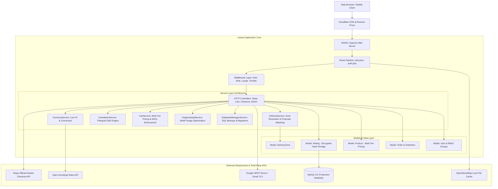
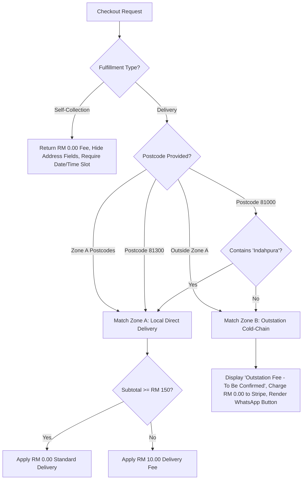

# System Architecture & Technical Specification

**Project:** MST Seafood Unified B2B & B2C E-Commerce Platform  
**Target File Reference:** `architcture.md`  
**Framework:** Laravel 11 (PHP 8.2+) LTS  
**Database:** MySQL 8.0 / MariaDB 10.11+  
**Architecture Pattern:** Service Layer Architecture with Multi-Tier Role-Based Access Control (RBAC)  

---

## 1. High-Level Architectural Diagram



---

## 2. Technology Stack & Component Architecture

### 2.1. Backend Framework (Laravel 11 LTS)
- **Language & Runtime:** PHP 8.2+ with strict typing and modern match expressions.
- **ORM & Data Layer:** Eloquent ORM utilizing normalized relational models, custom accessors, casting, and local query scopes.
- **Service Layer Pattern:** Business logic is decoupled from controllers and encapsulated in dedicated services under `app/Services/`.
- **Session & Caching:** File/Redis cached configuration with in-memory request-lifecycle memoization (`Setting::$inMemorySettings`).

### 2.2. Frontend Architecture
- **Blade Templating:** Semantic HTML5 templates utilizing layout inheritance (`layouts/app.blade.php`, `layouts/admin.blade.php`).
- **Styling & Design Tokens:** Vanilla CSS design tokens with custom HSL variables, fluid typography (`clamp()`), and responsive flexbox/grid layouts.
- **Interactivity:** Lightweight Vanilla JavaScript (ES6+) and Alpine.js for debounced API fee recalculations, collapsible summary trays, and interactive modals.
- **Performance Optimization:** Pingdom 100 benchmark setup with zero-redirect root homepage route (`home.root`) and cookie-free CDN asset routes (`/cdn-assets/...`).

### 2.3. Database Schema Design (MySQL 8.0)
The database structure is organized around core business entities:
- **`users`:** Customer identity, role groups (`retail`, `walkin`, `wholesale`, `trading`), business registration numbers (SSM), approval flags (`is_approved`), OTP fields, and marketing consent.
- **`products`:** SKU, catalog hierarchies, multi-tier prices (`price_retail`, `price_walkin`, `price_wholesale`, `price_trading`), multi-currency overrides, MOQ rules, storage specs, and catch-weight flags.
- **`delivery_zones`:** Code (`ZONE-A`, `ZONE-B`), 5-digit postcodes, sub-locality area lists, delivery fees, below-threshold fees, customer tier availability, and quotation switches.
- **`settings`:** Key-value configuration pairs with automated cryptographic hash/cipher storage for sensitive credentials.
- **`orders` & `order_items`:** Transactional records capturing customer snapshots, line-item pricing, fulfillment types, collection time slots, confirmed dispatch dates, and Stripe payment references.
- **`quotations` & `quotation_items`:** Bulk RFQ workflows for Floating Trading items with negotiation workbenches.
- **`translations`:** Dynamic UI translation dictionary across English, Chinese, and Malay.

---

## 3. Core Subsystems & Service Implementations

### 3.1. Delivery & Logistics Engine (`app/Services/DeliveryService.php`)
The logistics service resolves the appropriate fulfillment rules using a four-step pipeline:



### 3.2. Cryptographic Storage & Hash Architecture (`app/Models/Setting.php`)
To eliminate the exposure of cleartext passwords and API secrets in `.env` files, git repositories, or raw database backups:

1. **Sensitive Key Registry:** Keys matching `mail_password`, `stripe_secret`, `stripe_test_secret`, `stripe_live_secret`, `stripe_key`, `stripe_test_key`, `whatsapp_api_key`, or ending in `_secret` / `_password` are flagged as sensitive.
2. **Authenticated Storage Encryption:**
   ```php
   // Value transformed to AES-256-CBC cipher with HMAC-SHA256 signature
   'enc:' . Crypt::encryptString($plainValue);
   ```
   Stored in MySQL as an opaque hash/cipher string (`enc:eyJpdiI6IlMzN...`).
3. **Transparent On-the-Fly Decryption:**
   When accessed via `Setting::get($key)` or `Setting::allKeyed()`, the service detects the `enc:` prefix and decrypts the value directly into application memory.
4. **Decoupled Bootstrapping:** `AppServiceProvider::boot()` dynamically injects decrypted credentials into Laravel's `config(['mail.mailers.smtp.password' => ...])` and `config(['services.stripe.secret' => ...])` without writing to disk.

### 3.3. Multi-Currency & Live FX Engine (`app/Services/CurrencyService.php`)
- **Base Ledger Currency:** Malaysian Ringgit (MYR). All legal transactions, Stripe settlement intents, and database prices operate in MYR.
- **Automated Sync:** Integrates with `open.er-api.com` to pull hourly exchange rates for SGD and USD, caching values for 6 hours.
- **Admin Manual Control:** Admins can override live market rates with fixed spreads (`currency_manual_rate_sgd`, `currency_manual_rate_usd`) via Admin Panel > Settings.

### 3.4. Trilingual Translation CMS (`app/Services/TranslationService.php`)
- **Localization Helper:** Global `__t('key', 'Default English')` helper function.
- **Route Prefixing:** URL-based locale prefixes (`/en/`, `/zh/`, `/bm/`) with zero-redirect root homepage resolution based on cookie preferences.
- **High-Performance Caching:** Translations are loaded once per request lifecycle and stored in Redis/File cache with an administrative 1-click cache purge route.

---

## 4. Security & Hardening Architecture

1. **Zero Cleartext Credentials in `.env`:** Sensitive parameters (`MAIL_PASSWORD`, `STRIPE_KEY`, `STRIPE_SECRET`) are removed from `.env` and managed in encrypted database settings.
2. **Rate Limiting & Anti-Brute-Force:**
   - OTP verification throttled to 15 attempts / minute (`throttle:15,1`).
   - Checkout submission throttled to 10 requests / minute (`throttle:10,1`).
   - Contact form throttled to 5 submissions / minute (`throttle:5,1`).
3. **Session & Cookie Protections:** HTTP-only, SameSite=Lax session cookies with encrypted payloads.
4. **SQL Injection & XSS Mitigations:** 100% PDO parameterized queries via Eloquent ORM; Blade HTML sanitization (`{{ }}`); strict file upload validation (MIME-type checks and dimensions constraints).

---

## 5. Deployment & CI/CD Pipeline

- **Version Control:** Monitored Git repository on GitHub (`main` branch).
- **Automated Continuous Deployment:** Pushing to `origin/main` triggers GitHub Actions (`.github/workflows/deploy.yml`), which executes automated FTP deployment to the production server.
- **Database Migrations:** Executed safely via the administrative workbench (`Admin > Settings > Database > Run Migrations`) calling `Artisan::call('migrate', ['--force' => true])`.
