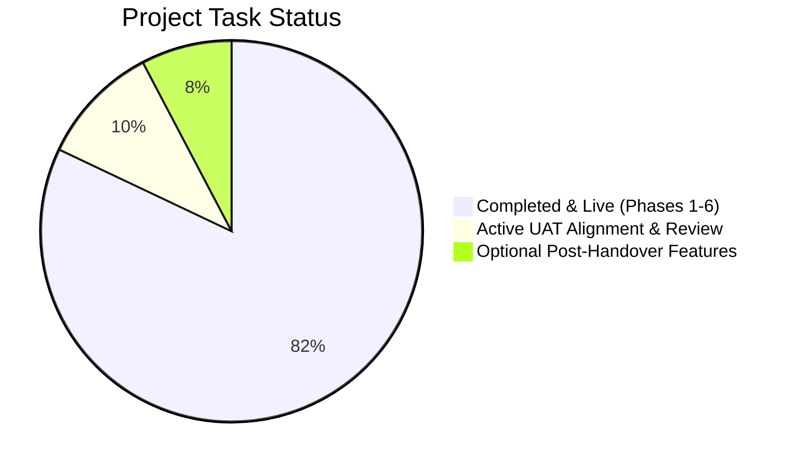

# Project Task Board & Execution Tracker

**Project:** MST Seafood Unified B2B & B2C E-Commerce Platform  
**Target File Reference:** `task.md`  
**Current Phase:** Final User Acceptance Testing (UAT) & Production Handover  
**Last Updated:** October 2026  

---

## 1. Task Status Overview

---

## 2. Completed Milestones & Development History

### Phase 1: Core Architecture & Multi-Tier Framework (Completed)
- [x] Initialized Laravel 11 LTS project with Eloquent ORM and MySQL 8.0 schema.
- [x] Implemented multi-tier customer group model (`retail`, `walkin`, `wholesale`, `trading`).
- [x] Developed server-side price protection engine (`Product::getPriceForGroup()`).
- [x] Built Walk-In Store QR Code engine with in-stock catalog filtering (`is_walkin_available`).
- [x] Implemented Wholesale & Trading onboarding forms with SSM registration validation.
- [x] Built back-office customer vetting workbench (`Admin/CustomerController.php`).

### Phase 2: Catalog, Cart & Minimum Order Quantities (Completed)
- [x] Implemented product specifications (origin, catch method, glazing, storage temperature).
- [x] Built multi-tier Minimum Order Quantity (MOQ) validation for Wholesale and Trading.
- [x] Created visual cart progress tracker for free delivery threshold gamification.
- [x] Built Request for Quotation (RFQ) inquiry cart and quotation workbench for Trading clients.
- [x] Implemented 1-click Quote-to-Order conversion within custom validity windows.

### Phase 3: Checkout, Stripe Payments & Fulfillment (Completed)
- [x] Integrated official Stripe Hosted Checkout with automated webhook signature validation.
- [x] Built Store Self-Collection flow at SILC Counter 2 with hidden address fields.
- [x] Enforced mandatory collection date and shift time slot selection (4 daily shifts).
- [x] Added immediate cash order processing for in-store walk-in counter clients.
- [x] Created printable formal tax invoice template (`/admin/orders/{id}/invoice`).

### Phase 4: Extended Value-Add Modules (Completed at No Charge)
- [x] **Trilingual Localization Engine:** Added English, Simplified Chinese (简体中文), and Bahasa Melayu (BM) with URL prefixing and dynamic Translation CMS (`/admin/translations`).
- [x] **Multi-Currency Engine:** Added real-time exchange rates (MYR/SGD/USD) via Open Exchange Rates API with manual admin override spreads.
- [x] **Email OTP Security:** Integrated 6-digit email OTP verification upon customer registration with brute-force lockout.
- [x] **Corporate SSM Deduplication:** Built duplicate phone and SSM alert detection during B2B onboarding.
- [x] **Catch-Weight Seafood Support:** Added database schemas and UI support for random-weight seafood items.
- [x] **Media Asset Manager:** Built `/admin/gallery` with folder management and WebP auto-compression.
- [x] **1-Click SQL Database Backup Manager:** Built `/admin/database` to generate and download self-contained `.sql` dumps.

### Phase 5: Client Consolidation & Delivery Alignment (Completed)
- [x] Cross-referenced Johor postal directory on Postcode.my for 10 confirmed Zone A areas.
- [x] Implemented strict Kulai rule: Postcode `81000` requires `indahpura` keyword; general Kulai is routed to Outstation.
- [x] Removed hardcoded exclusion on Skudai postcode `81300`; verified Zone A recognition.
- [x] Reaffirmed delivery threshold logic: Zone A `< RM150` = RM10 fee; `≥ RM150` = Free delivery.
- [x] Configured Outstation notice: Displays *“Outstation Transportation Fee — To Be Confirmed”* with WhatsApp button; RM0 charged to Stripe.
- [x] Synchronized delivery calculation across Cart API and Checkout order pipeline.

### Phase 6: Security Hardening & Documentation (Completed)
- [x] Implemented cryptographic Hash/Cipher storage (`enc:...`) for sensitive keys in `app/Models/Setting.php`.
- [x] Sanitized `.env` file by removing plaintext Google app passwords and Stripe API secrets.
- [x] Created migration `2026_10_09_000002_secure_env_credentials_to_encrypted_database_settings.php`.
- [x] Created artisan command `php artisan settings:secure` (`SecureCredentialsCommand.php`).
- [x] Generated Document 1: `MST_Website_Admin_Panel_and_Operations_Manual.docx` (1.98 MB illustrated back-office manual).
- [x] Generated Document 2: `MST_Formal_Client_Response_and_Final_Handover_Report.docx` (45 KB scope confirmation, 6 handover items & 30-day warranty).
- [x] Committed and pushed all updates to GitHub (`origin/main`, commit `997d5cdb`).
- [x] Initialized and verified local runtime: MySQL 8.4 on port 3306, Vite build, and Laravel serving on port 8001.

---

## 3. Active Tasks (Current Focus: Final UAT Sign-Off)

- [ ] **Task 3.1: Client Verification of Zone A Postcodes**
  - *Owner:* Wendy (Client Lead) & Abdul Rehman
  - *Action:* Confirm that the 10 compiled areas from Postcode.my match MST operational intentions.
  - *Status:* Directory compiled, deployed, and submitted for review.
- [ ] **Task 3.2: End-to-End Regression Testing by Client**
  - *Owner:* Wendy
  - *Action:* Execute test orders across Zone A (< RM150 vs ≥ RM150), Kulai Indahpura, Outstation (WhatsApp link), and Self-Collection.
  - *Status:* Testing instructions supplied in handover document.
- [x] **Task 3.3: Administrator Manual & Operations Handover**
  - *Owner:* Abdul Rehman & Wendy
  - *Action:* Deliver complete illustrated step-by-step admin manual as Word attachment (`.docx`).
  - *Status:* [x] Completed and versioned (`MST_Website_Admin_Panel_and_Operations_Manual.docx`).
- [ ] **Task 3.4: Final Project Sign-Off & Appreciation Review**
  - *Owner:* Wendy & Abdul Rehman
  - *Action:* Formal client review of handover checklist, live cutover, 30-day warranty activation, and appreciation tip review.
  - *Status:* Pending client testing completion.

---

## 4. Backlog / Optional Future Enhancements (Post-Handover)

- [ ] **Feature B.1: Coupon Code & Marketing Attribution Module**
  - *Scope:* Promo code field at checkout (e.g. `FBMST10`, `WAMST10`, `TIKTOK10`, `REFMST10`), percentage/fixed discounts, spend limits, date windows, and tracking marketing channels / referral partners.
  - *Commercial Quote:* RM 650.00 (Timeline: 3–5 days).
  - *Status:* Quoted and on hold per Wendy's direction to prioritize primary UAT.
- [ ] **Feature B.2: Direct Local FPX Banking Integration**
  - *Scope:* Integration with Malaysian FPX payment providers (ToyyibPay, SenangPay, or Curlec).
  - *Status:* Optional future enhancement if MST expands local consumer checkout methods.
- [ ] **Feature B.3: Automated WhatsApp Cloud API Webhooks**
  - *Scope:* Programmatic WhatsApp template message dispatch for order receipts and dispatch tracking.
  - *Status:* Optional future enhancement.
- [ ] **Feature B.4: Cloud Hosting Migration**
  - *Scope:* Transitioning from free hosting to high-speed Singapore Cloud VPS (DigitalOcean / ServerFreak).
  - *Status:* Proposed in technical hosting guide.
